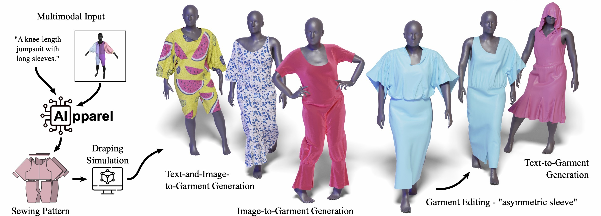

# Code Repository for AIpparel: A Multimodal Foundation Model for Digital Garments _(CVPR 2025 Highlight)_. 
<p align="center">
  <a href='[https://arxiv.org/abs/2405.04533](https://arxiv.org/abs/2412.03937)'>
    
  </a>
  <a href='https://georgenakayama.github.io/AIpparel/'>
  
  </a>
  <a href='https://huggingface.co/georgeNakayama/AIpparel'>
  
  </a>
</p>



## Dataset 
Please download our [GarmentCodeData-Multimodal dataset](https://huggingface.co/georgeNakayama/AIpparel) (**gcd_mm_editing.zip** and **gcd_mm_captions.zip**), which annotates [GarmentCodeData](https://www.research-collection.ethz.ch/handle/20.500.11850/673889) with editing instructions and textual descriptions. Unzip the downloaded zip file and change the dataset [config file](configs/data_wrapper/dataset/gcd_mm.yaml) to point to the unzipped directories. 

## Pre-trained Model Weights
Download the pre-trained AIpparel model weights [here](https://huggingface.co/georgeNakayama/AIpparel) (**aipparel_pretrained.pth**). To evaluate or generate sewing patterns using it, change the [config](configs/aipparel.yaml) _(pre\_trained)_ to point to the the downloaded pre-trained weights.

## Logging
We provide logging logistics using WANDB. Set your username [here](configs/experiment/wandb_info/wandb.yaml) and login to your account through the command line.

## Evaluation 
We provide evaluation scripts under eval_scripts directory. Change environment variables to set the visible GPU devices and the path to this repository. Metrics will be saved to Wandb, and generated outputs will be saved to the output directory (set in the [config](configs/aipparel.yaml)).

## Training
For training, we provide a training script under train_scripts directory. Change environment variables to set the visible GPU devices and the path to this repository. Training logs will be saved to Wandb.

## Citation

If you are using our model or dataset in your project, consider citing our paper.

```
@article{nakayama2024aipparel,
    title={AIpparel: A Large Multimodal Generative Model for Digital Garments}, 
    author={Kiyohiro Nakayama and Jan Ackermann and Timur Levent Kesdogan 
            and Yang Zheng and Maria Korosteleva and Olga Sorkine-Hornung and Leonidas Guibas
            and Guandao Yang and Gordon Wetzstein},
    journal = {Computer Vision and Pattern Recognition (CVPR)},
    year={2025}
}
```
